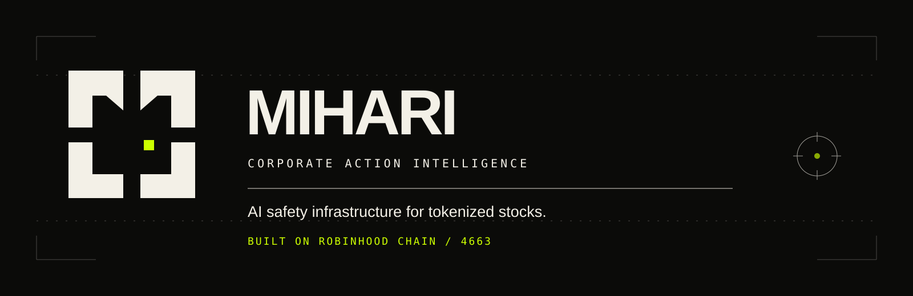
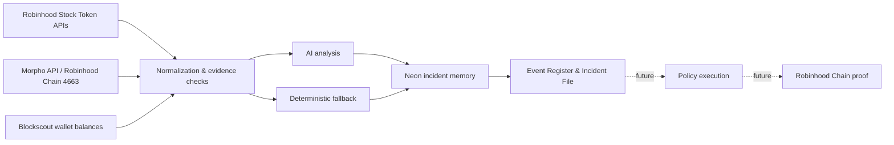

<div align="center">
  

  <br />

  [](https://mihari.pro)
  [](https://robinhoodchain.blockscout.com)
  [](https://nextjs.org)
  [](https://www.typescriptlang.org)
  [](https://robinhoodchain.blockscout.com/address/0x92150e06BAc43011cBe099b2830D947Ee3099809)

  <h3>AI safety infrastructure for tokenized stocks.</h3>

  <p>
    MIHARI monitors official Robinhood Stock Token data, detects corporate actions,<br />
    maps potential DeFi impact and recommends a bounded response.
  </p>

  <p>
    <a href="https://mihari.pro"><strong>Live product</strong></a>
    ·
    <a href="https://mihari.pro/launch"><strong>Launch app</strong></a>
    ·
    <a href="https://mihari.pro/docs"><strong>Documentation</strong></a>
    ·
    <a href="#quick-start"><strong>Quick start</strong></a>
  </p>
</div>

---

## Why MIHARI

Tokenized stocks make equities composable across DeFi. Corporate actions become composable too.

A dividend, split or multiplier change can affect much more than the displayed asset price. If one protocol uses stale data, incorrect valuation can propagate into NAV, quotes, vault accounting, lending collateral and automated strategies.

MIHARI turns each official event into an explainable **Incident File**:

> **What changed → where risk may spread → what a safe response could be**

MIHARI currently monitors and recommends. It does not move funds or execute transactions automatically.

## Product workflow

| Step | User action | What MIHARI does |
| :---: | --- | --- |
| `01` | Enter public Observe mode or create a profile | Opens read-only monitoring, email access or wallet-native access |
| `02` | Select up to 20 Stock Tokens | Creates the private monitoring scope |
| `03` | Start Observe mode | Syncs official asset, price, multiplier and corporate-action data |
| `04` | Review the Event Register | Surfaces only watched assets with matching events |
| `05` | Open an Incident File | Explains evidence, risk, affected systems and confidence |
| `06` | Open DeFi Exposure | Checks supported vault and lending positions for Stock Token exposure |
| `07` | Review the Bounded Response | Recommends a safe next step while the operator remains in control |

## What is live

| Capability | Status | Description |
| --- | :---: | --- |
| Robinhood Stock Token catalog | `LIVE` | Full active catalog, search and private watchlists of up to 20 assets |
| Corporate-action Event Register | `LIVE` | Official events filtered through the selected watchlist |
| Price and multiplier context | `LIVE` | Robinhood market data attached to the monitored assets |
| AI Incident Files | `LIVE` | Observation, Impact Map, risk, confidence and Bounded Response |
| Incident memory | `LIVE` | Neon persistence and cached analysis to avoid duplicate AI cost |
| Email and wallet profiles | `LIVE` | Email and password or an EVM signature creates a secure personal workspace |
| Personal Asset Manager | `LIVE` | Add, remove, search and save monitored Stock Tokens inside the private workspace |
| Private Event Register | `LIVE` | Refreshes watchlist corporate actions every 60 seconds while the view is open and opens an Incident File |
| Wallet verification | `LIVE` | Free message signature proves ownership without a transaction |
| `$MHR` wallet status | `LIVE` | Checks the official token balance per verified wallet and reports Holder, Not Held or Unavailable |
| Wallet Stock Token mapping | `LIVE` | Every verified address is scanned automatically for all official Robinhood Stock Tokens through Robinhood Chain Blockscout |
| Personal exposure matching | `LIVE` | Corporate actions are matched to Stock Tokens found in linked wallets, independent of the watchlist |
| Personal risk files | `LIVE` | Event matches open position context, AI or rule-based impact analysis and a bounded response |
| Morpho vault and lending discovery | `IN DEVELOPMENT` | Scans verified wallets for Stock Token supply, borrow, collateral and vault positions on Robinhood Chain |
| Policy execution | `NEXT` | No automatic protocol action or fund movement today |
| Onchain proofs | `NEXT` | Production attestations require audited contracts |

## System architecture



MIHARI is intentionally hybrid. Official market data and AI inference run offchain; future policy configuration, execution receipts and attestations are designed for Robinhood Chain.

## $MHR

> [!IMPORTANT]
> Always verify the contract address before interacting. Planned utility features are not all active today.

| | |
| --- | --- |
| **Network** | Robinhood Chain |
| **Symbol** | `$MHR` |
| **Contract** | `0x92150e06BAc43011cBe099b2830D947Ee3099809` |
| **Explorer** | [View contract on Blockscout ↗](https://robinhoodchain.blockscout.com/address/0x92150e06BAc43011cBe099b2830D947Ee3099809) |

Planned utility is designed around product use:

- **Hold**: unlock premium monitoring and AI features.
- **Lock**: receive higher limits, product credits and lower usage fees.
- **Spend**: pay for AI analysis, APIs, position scans and future proofs.
- **Stake**: support future network security and operator incentives.
- **Burn**: remove a portion of usage fees from supply as the product is used.

## Roadmap

| Phase | Status | Focus |
| --- | :---: | --- |
| **01 · Observe** | `LIVE` | Official data, watchlists, Event Register, AI Incident Files and read-only identity |
| **02 · Map** | `IN PROGRESS` | Profiles, watchlists and direct wallet exposure are live. Morpho vault and lending discovery is being built in `feature/defi-exposure` |
| **03 · Guard** | `PLANNED` | Deterministic policies, operator approval, transaction previews and bounded actions |
| **04 · Prove** | `PLANNED` | Audited contracts, onchain receipts, independent operators and verifiable monitoring |

Each phase ships only after its data sources, permissions and security assumptions can be verified in production.

## Tech stack

| Layer | Technology |
| --- | --- |
| Application | Next.js 16, React 19, TypeScript |
| Intelligence | Vercel AI SDK, OpenAI, deterministic rule fallback |
| Data | Robinhood Stock Token APIs |
| Persistence | Neon Postgres, Drizzle ORM |
| Authentication | Clerk email and password plus signed EVM wallet sessions |
| Chain | Robinhood Chain, viem |
| Contracts | Solidity, OpenZeppelin |
| Hosting | Vercel |

## Quick start

### Requirements

- Node.js 22 or newer
- npm

```bash
git clone https://github.com/jiyu1337/mihari.git
cd mihari
npm install
cp .env.example .env.local
npm run dev
```

Open [http://localhost:3000](http://localhost:3000).

The interface can run without database or AI credentials by using safe fallback paths. Add server-side credentials to `.env.local` to test the complete stack. Never prefix secrets with `NEXT_PUBLIC_`.

<details>
<summary><strong>Environment variables</strong></summary>

Use [`.env.example`](./.env.example) as the source of truth.

| Variable | Purpose |
| --- | --- |
| `OPENAI_API_KEY` | Server-side AI analysis |
| `MIHARI_AI_MODEL` | OpenAI model selection |
| `NEON_DATABASE_DATABASE_URL` or another supported Neon URL | Incident persistence and AI caching |
| `ROBINHOOD_API_BASE_URL` | Robinhood Stock Token API base URL |
| `NEXT_PUBLIC_CHAIN_ID` | Robinhood Chain ID |
| `NEXT_PUBLIC_RPC_URL` | Public Robinhood Chain RPC |
| `NEXT_PUBLIC_CLERK_PUBLISHABLE_KEY` | Public Clerk application key |
| `CLERK_SECRET_KEY` | Server-side Clerk authentication key |
| `WALLET_SESSION_SECRET` | Optional dedicated HMAC secret for wallet sessions. Falls back to `CLERK_SECRET_KEY` |

</details>

<details>
<summary><strong>Available commands</strong></summary>

```bash
npm run dev               # Start local development
npm run typecheck         # Generate route types and run TypeScript
npm run lint              # Run ESLint
npm run build             # Run migrations and create a production build
npm run db:migrate        # Apply database migrations
npm run contracts:compile # Compile the Solidity contracts
```

</details>

## Repository map

```text
app/                  Next.js pages and server routes
components/           Product interface components
contracts/            Solidity reference implementations
db/                   Drizzle schema and database access
docs/                 Architecture, owner guide and content plan
lib/                  Robinhood, AI and product-domain logic
scripts/              Database and maintenance scripts
```

## Documentation

- [Public product documentation](https://mihari.pro/docs)
- [Technical and trust architecture](./docs/ARCHITECTURE.md)
- [Product-owner setup](./docs/OWNER-GUIDE.md)
- [Personal workspace and exposure statuses](./docs/PERSONAL-WORKSPACE.md)
- [Robinhood Chain contracts](./contracts/README.md)
- [Content and demo plan](./docs/CONTENT-PLAN.md)

## Security

> [!WARNING]
> The Solidity contracts in this repository are unaudited reference implementations. Do not use them to secure production funds.

- Never commit `.env` or `.env.local`.
- Never expose API keys, database credentials or wallet private keys to the browser.
- MIHARI will never ask for a seed phrase or private key.
- Report suspected credential leaks privately before opening a public issue.

## Disclaimer

MIHARI is an independent software project. It is not a broker, financial adviser or investment service. Product analysis is informational and does not guarantee financial outcomes.

---

<div align="center">
  <strong>MIHARI</strong><br />
  Monitor. Understand. Respond.<br />
  <sub>Built on Robinhood Chain.</sub>
</div>
